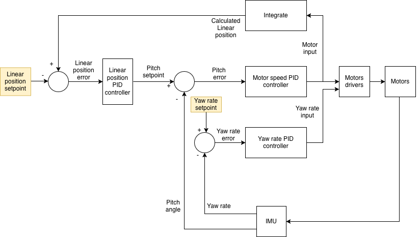

# Self-balancing robot

This repo contains designs for a self-balancing robot (inverted pendulum). Balance is achieved with multiple PID controllers, the setpoints for which come from a phone app over bluetooth.

## Components
* 2x DRV8825 stepper drivers set in 1/32 microstepping mode
* 1x TTGO T-Display (ESP32)
* Custom PCB (see `/pcb` folder) featuring power regulation and IMU (MPU6050)
* Custom frame made from wood, motor brackets, M5 bolts and nuts
* Stepper motors (200 steps per revolution) with 90 degree brackets
* 90 mm wheels and wheel hubs
* Custom [Roboremo app](https://www.roboremo.app/) on phone for control and PID tuning.

## Design

Pitch angle is measured from the IMU using accelerometer and gyroscope values, combined using a complementary filter. An inner PID loop adjusts motor speed to achieve desired angle and keep the robot vertical. 

However, once the robot has achieved this angle it would consider this a job well done even though it might be moving forward/backward at a constant speed. Further, slight imperfections in weight distribution or IMU alignment/calibration might mean that a reading of 0 deg might not result in perfect balance. Thus we need a second PID loop that measures the linear position (derived from nominal motor speed) and adjusts the desired pitch angle accordingly so that the robot attempts to stay on the same spot. Setpoint for position is hardcoded for now, but mau be set by bluetooth command in the future. 

All user interface functions are offloaded onto the second core: display updates, receiving bluetooth messages, etc. This is to keep the PID loop(s) rapid. The challange here is that the ESP32's second core is busy with issuing motor step pulses, and bluetooth connections are (currently) a blocking operarion. So the robot is temporarily disabled while receiving bluetooth updates. Thus, they cannot be used for steering and/or position control as it currently stands.

`src/main.cpp` contains the main program logic. However, each area of concern is abstracted out into it's own class: IMU, PID, display, bluetooth, etc. This modularity of code should make it easy to upgrade parts, e.g. using a new type of IMU, and also to extend functionality. Pin assignments and other config parameters are in `Config.h`. State-related variables and PID tuning coefficients are in `Status.h`.

## PCB
The PCB was designed in EasyEDA-Pro and ordered from JLCPCB. All components are either "basic" or "extended promotional" at the time, meaning that they don't incur the component handling/loading fee. Exceptions to this include the on/off switch and through-hole components (headers and screw connector for power wires), which were excluded from the BOM and hand-soldered when the PCB arrived. 

## Challenges and Considerations
* Motor vibration. This is the biggest killer. The robot cannot balance if it can't accurately tell which way is down due to sensor noise contamination. To address this, try to mechanically decoouple PCB from motor mounts by mounting the PCB with thick foam tape. Also, the IMU low-pass filter is enabled (~40 hz cutoff), and outputs are passed through a 4th order butterworth low-pass filter with 10 Hz cutoff. When the motors are moving slowly (low speed), we adjust the IMU complementary filter to rely mostly on the gyro. When it's moving faster, we increase accelerometer contribution.
* In the ideal case, the only relevant acceleration is gravity. However accelerations from rapid changes to pitch angle can affect the readings. The PCB with IMU should be mounted close to (but mechanically decoupled from) the motor axis.
* The PID loop time should be kept quick, but consistent. In this instance, it's 250 Hz (4 milliseconds loop time). The secondary PID loops (for position and yaw control) are updated every at 50 Hz (20 milliseconds loop time).
* Make sure to set motor current limiting correctly.